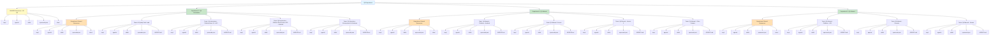

# QA Department Structure

```mermaid
graph TD
    QA[QA Department]
    
    %% Shared Resources
    QA --> SHARED[SHARED Resources - All QA]
    SHARED --> SHARED_MCP[mcp/]
    SHARED --> SHARED_AGENTS[agents/]
    SHARED --> SHARED_SKILLS[skills/]
    SHARED --> SHARED_CONFIG[opencode.json]
    SHARED --> SHARED_RULES[rules/]
    
    %% Department 1: QA Automation
    QA --> DEPT1[Department 1: QA Automation]
    DEPT1 --> DEPT1_SHARED[Department Shared Resources]
    DEPT1_SHARED --> DEPT1_MCP[mcp/]
    DEPT1_SHARED --> DEPT1_AGENTS[agents/]
    DEPT1_SHARED --> DEPT1_SKILLS[skills/]
    DEPT1_SHARED --> DEPT1_CONFIG[opencode.json]
    DEPT1_SHARED --> DEPT1_RULES[rules/]
    
    DEPT1 --> TEAM1_1[Team: AI Quality Tech Lead]
    TEAM1_1 --> TEAM1_1_MCP[mcp/]
    TEAM1_1 --> TEAM1_1_AGENTS[agents/]
    TEAM1_1 --> TEAM1_1_SKILLS[skills/]
    TEAM1_1 --> TEAM1_1_CONFIG[opencode.json]
    TEAM1_1 --> TEAM1_1_AGENTS_MD[AGENTS.md]
    
    DEPT1 --> TEAM1_2[Team: QA Automation - Platform Mock UI + API]
    TEAM1_2 --> TEAM1_2_MCP[mcp/]
    TEAM1_2 --> TEAM1_2_AGENTS[agents/]
    TEAM1_2 --> TEAM1_2_SKILLS[skills/]
    TEAM1_2 --> TEAM1_2_CONFIG[opencode.json]
    TEAM1_2 --> TEAM1_2_AGENTS_MD[AGENTS.md]
    
    DEPT1 --> TEAM1_3[Team: QA Automation - Platform Real Devices iOS + Android]
    TEAM1_3 --> TEAM1_3_MCP[mcp/]
    TEAM1_3 --> TEAM1_3_AGENTS[agents/]
    TEAM1_3 --> TEAM1_3_SKILLS[skills/]
    TEAM1_3 --> TEAM1_3_CONFIG[opencode.json]
    TEAM1_3 --> TEAM1_3_AGENTS_MD[AGENTS.md]
    
    DEPT1 --> TEAM1_4[Team: QA Operation - Environments & Solutions]
    TEAM1_4 --> TEAM1_4_MCP[mcp/]
    TEAM1_4 --> TEAM1_4_AGENTS[agents/]
    TEAM1_4 --> TEAM1_4_SKILLS[skills/]
    TEAM1_4 --> TEAM1_4_CONFIG[opencode.json]
    TEAM1_4 --> TEAM1_4_AGENTS_MD[AGENTS.md]
    
    %% Department 2: QA Manual
    QA --> DEPT2[Department 2: QA Manual]
    DEPT2 --> DEPT2_SHARED[Department Shared Resources]
    DEPT2_SHARED --> DEPT2_MCP[mcp/]
    DEPT2_SHARED --> DEPT2_AGENTS[agents/]
    DEPT2_SHARED --> DEPT2_SKILLS[skills/]
    DEPT2_SHARED --> DEPT2_CONFIG[opencode.json]
    DEPT2_SHARED --> DEPT2_RULES[rules/]
    
    DEPT2 --> TEAM2_1[Team: QA Manual - Platform + Android]
    TEAM2_1 --> TEAM2_1_MCP[mcp/]
    TEAM2_1 --> TEAM2_1_AGENTS[agents/]
    TEAM2_1 --> TEAM2_1_SKILLS[skills/]
    TEAM2_1 --> TEAM2_1_CONFIG[opencode.json]
    TEAM2_1 --> TEAM2_1_AGENTS_MD[AGENTS.md]
    
    DEPT2 --> TEAM2_2[Team: QA Manual - Access]
    TEAM2_2 --> TEAM2_2_MCP[mcp/]
    TEAM2_2 --> TEAM2_2_AGENTS[agents/]
    TEAM2_2 --> TEAM2_2_SKILLS[skills/]
    TEAM2_2 --> TEAM2_2_CONFIG[opencode.json]
    TEAM2_2 --> TEAM2_2_AGENTS_MD[AGENTS.md]
    
    DEPT2 --> TEAM2_3[Team: QA Manual - Access 2]
    TEAM2_3 --> TEAM2_3_MCP[mcp/]
    TEAM2_3 --> TEAM2_3_AGENTS[agents/]
    TEAM2_3 --> TEAM2_3_SKILLS[skills/]
    TEAM2_3 --> TEAM2_3_CONFIG[opencode.json]
    TEAM2_3 --> TEAM2_3_AGENTS_MD[AGENTS.md]
    
    DEPT2 --> TEAM2_4[Team: QA Manual - Other Product]
    TEAM2_4 --> TEAM2_4_MCP[mcp/]
    TEAM2_4 --> TEAM2_4_AGENTS[agents/]
    TEAM2_4 --> TEAM2_4_SKILLS[skills/]
    TEAM2_4 --> TEAM2_4_CONFIG[opencode.json]
    TEAM2_4 --> TEAM2_4_AGENTS_MD[AGENTS.md]
    
    %% Department 3: QA Manual
    QA --> DEPT3[Department 3: QA Manual]
    DEPT3 --> DEPT3_SHARED[Department Shared Resources]
    DEPT3_SHARED --> DEPT3_MCP[mcp/]
    DEPT3_SHARED --> DEPT3_AGENTS[agents/]
    DEPT3_SHARED --> DEPT3_SKILLS[skills/]
    DEPT3_SHARED --> DEPT3_CONFIG[opencode.json]
    DEPT3_SHARED --> DEPT3_RULES[rules/]
    
    DEPT3 --> TEAM3_1[Team: QA Manual - Platform + iOS]
    TEAM3_1 --> TEAM3_1_MCP[mcp/]
    TEAM3_1 --> TEAM3_1_AGENTS[agents/]
    TEAM3_1 --> TEAM3_1_SKILLS[skills/]
    TEAM3_1 --> TEAM3_1_CONFIG[opencode.json]
    TEAM3_1 --> TEAM3_1_AGENTS_MD[AGENTS.md]
    
    DEPT3 --> TEAM3_2[Team: QA Manual - Forensic]
    TEAM3_2 --> TEAM3_2_MCP[mcp/]
    TEAM3_2 --> TEAM3_2_AGENTS[agents/]
    TEAM3_2 --> TEAM3_2_SKILLS[skills/]
    TEAM3_2 --> TEAM3_2_CONFIG[opencode.json]
    TEAM3_2 --> TEAM3_2_AGENTS_MD[AGENTS.md]
    
    DEPT3 --> TEAM3_3[Team: QA Manual - Access]
    TEAM3_3 --> TEAM3_3_MCP[mcp/]
    TEAM3_3 --> TEAM3_3_AGENTS[agents/]
    TEAM3_3 --> TEAM3_3_SKILLS[skills/]
    TEAM3_3 --> TEAM3_3_CONFIG[opencode.json]
    TEAM3_3 --> TEAM3_3_AGENTS_MD[AGENTS.md]
    
    style QA fill:#e1f5ff
    style SHARED fill:#fff9c4
    style DEPT1 fill:#c8e6c9
    style DEPT2 fill:#c8e6c9
    style DEPT3 fill:#c8e6c9
    style DEPT1_SHARED fill:#ffe0b2
    style DEPT2_SHARED fill:#ffe0b2
    style DEPT3_SHARED fill:#ffe0b2
```

