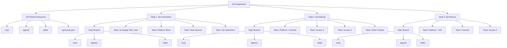

# QA Department Structure

```mermaid
graph TB
    QA[QA Department]
    
    QA --> SHARED[QA Shared Resources]
    SHARED --> S_MCP[mcp/]
    SHARED --> S_AGENTS[agents/]
    SHARED --> S_SKILLS[skills/]
    SHARED --> S_CONFIG[opencode.json]
    
    QA --> D1[Dept 1: QA Automation]
    D1 --> D1_SHARED[Dept Shared]
    D1_SHARED --> D1_MCP[mcp/]
    D1_SHARED --> D1_AGENTS[agents/]
    D1_SHARED --> D1_SKILLS[skills/]
    
    D1 --> T1_1[Team: AI Quality Tech Lead]
    D1 --> T1_2[Team: Platform Mock]
    D1 --> T1_3[Team: Real Devices]
    D1 --> T1_4[Team: QA Operations]
    
    QA --> D2[Dept 2: QA Manual]
    D2 --> D2_SHARED[Dept Shared]
    D2_SHARED --> D2_MCP[mcp/]
    D2_SHARED --> D2_AGENTS[agents/]
    D2_SHARED --> D2_SKILLS[skills/]
    
    D2 --> T2_1[Team: Platform + Android]
    D2 --> T2_2[Team: Access 1]
    D2 --> T2_3[Team: Access 2]
    D2 --> T2_4[Team: Other Product]
    
    QA --> D3[Dept 3: QA Manual]
    D3 --> D3_SHARED[Dept Shared]
    D3_SHARED --> D3_MCP[mcp/]
    D3_SHARED --> D3_AGENTS[agents/]
    D3_SHARED --> D3_SKILLS[skills/]
    
    D3 --> T3_1[Team: Platform + iOS]
    D3 --> T3_2[Team: Forensic]
    D3 --> T3_3[Team: Access 3]
```
